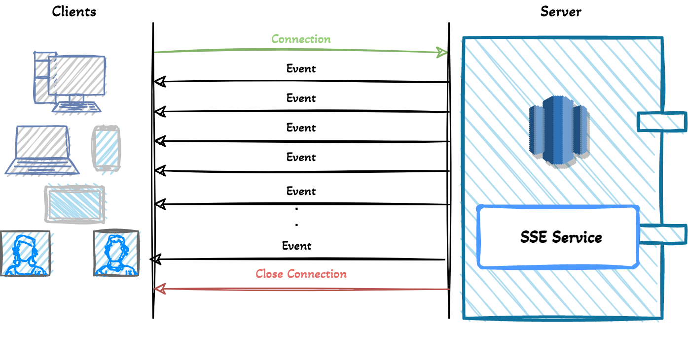

# Spring Server-Sent Events

This project is a sample application with Server-Sent Events (SSE) support.

## About SSE
A server-sent event is when a web page automatically gets updates from a server. This was also possible before, but the web page would have to ask if any updates were available. With server-sent events, the updates come automatically.



## Requirements

For building and running the application you need:

  - Java 17 
  - Maven 3.6.0
  - Spring Boot Framework

## Quickstart

From the command line do:

```
git clone https://github.com/mmendespro/spring-sse-poc.git
cd spring-sse-poc
mvn clean package
java -jar target/spring-sse-poc-0.0.1-SNAPSHOT.jar
```

## Copyright

Released under the Apache License 2.0. See the [LICENSE](https://github.com/codecentric/springboot-sample-app/blob/master/LICENSE) file.